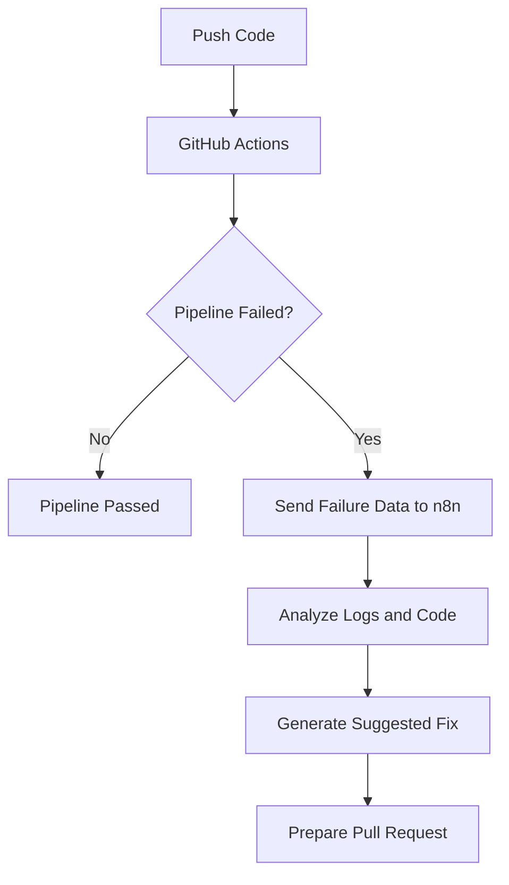

# Self-Healing CI/CD Pipeline with n8n

A learning project that demonstrates a **self-healing CI/CD pipeline** using **GitHub Actions**, **n8n**, and AI-powered failure analysis.

When the GitHub Actions pipeline fails, it sends failure details to an n8n workflow. n8n then collects logs, analyzes the error, and prepares an automated fix workflow.

---

## 🚀 Features

* Detects GitHub Actions pipeline failures
* Sends failure data to n8n using a webhook
* Collects failed job logs and changed files
* Uses AI to analyze errors
* Generates suggested code fixes
* Prepares data for automated pull requests

---

## 🛠️ Tech Stack

* GitHub Actions
* n8n
* Node.js
* JavaScript
* GitHub API
* AI failure analysis

---

## ⚙️ How It Works



---

## 📦 Installation

```bash
git clone https://github.com/NVGSpecOps/Self-Healing-CI-CD-Pipeline-N8N.git
cd Self-Healing-CI-CD-Pipeline-N8N
npm install
```

---

## 🧪 Run Tests

```bash
npm test
```

---

## 🏗️ Build

```bash
npm run build
```

---

## 📁 Important Files

| File                         | Description                         |
| ---------------------------- | ----------------------------------- |
| `.github/workflows/main.yml` | GitHub Actions CI workflow          |
| `My workflow.json`           | Exported n8n workflow               |
| `AI-Prompt.txt`              | Prompt used for AI failure analysis |
| `extract-ai-response.js`     | Parses AI-generated fix output      |
| `code-in-is-node.js`         | Prepares CI/CD failure context      |

---

## 🔐 Required Secrets

Add these secrets in GitHub or n8n:

```env
N8N_WEBHOOK_URL=
N8N_WEBHOOK_SECRET=
GITHUB_TOKEN=
OPENAI_API_KEY=
```

---

## 📚 Learning Goal

This project helps me learn how CI/CD automation, n8n workflows, GitHub Actions, and AI can work together to detect and fix pipeline failures automatically.

---

## 👨‍💻 Author

**NVGSpecOps**

Repository: [Self-Healing-CI-CD-Pipeline-N8N](https://github.com/NVGSpecOps/Self-Healing-CI-CD-Pipeline-N8N)

---
